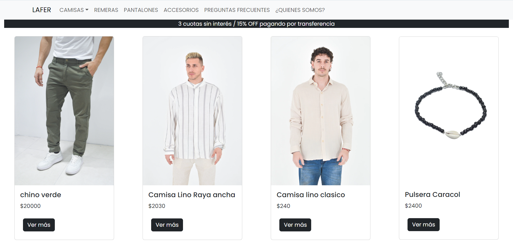

# Lafer - Tienda de ropa 👔

Este proyecto aplica los conceptos aprendidos en el curso de React JS de Coderhouse. Y pone en práctica componentes reutilizables, el uso de props y estados, el manejo de rutas con React Router, y la integración de librerías como React Bootstrap para estilizar la interfaz. Además, implementé funcionalidades clave como el consumo de datos desde una base externa (Firebase/MockAPI), creación de un carrito de compras y control de la lógica de navegación.

### Demo 💻

Se puede ver el demo de la web en el siguiente link: [Lafer](https://leagueofhighlights.herokuapp.com/)

### Instalación 🔧

Si desea correr este proyecto:

* Clone este repositorio 
* Ejecute "npm install"
* Ejecute "npm run dev" para levantarlo en un servidor local

## Librerias 🛠️

Este proyecto fue realizado por las siguientes tecnologías

* [React](https://reactjs.org/) - Librería de Javascript
* [react-bootstrap](https://react-bootstrap.netlify.app) - Implementación de los componentes de Bootstrap adaptados para React
* [Firebase](https://firebase.google.com/): utilizada como base de datos
* [React Router Dom](https://reactrouter.com/): navegación por rutas
* [React Icons](https://react-icons.github.io/react-icons/): utilizada en los iconos del sitio
* [React Hook Form](https://reactrouter.com/): validación de formularios

